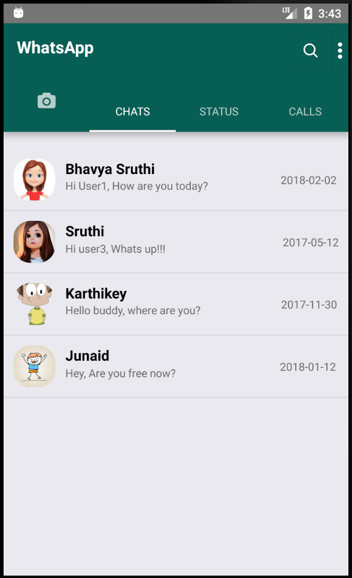
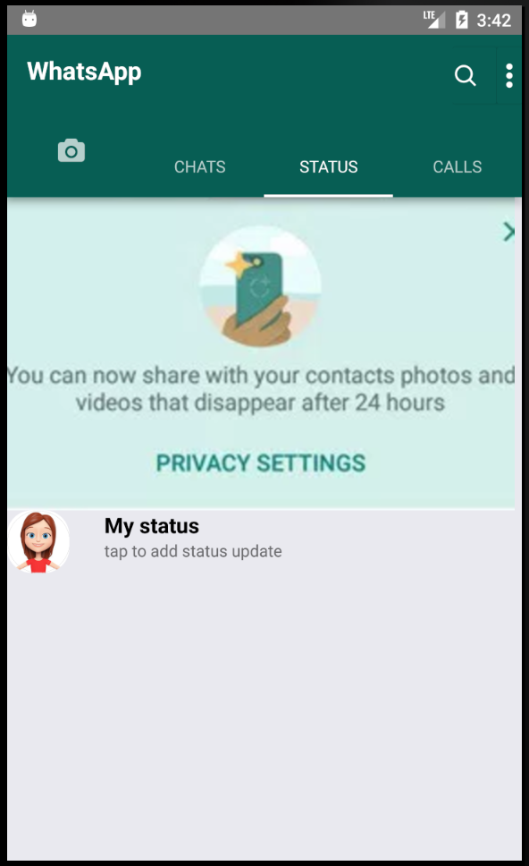
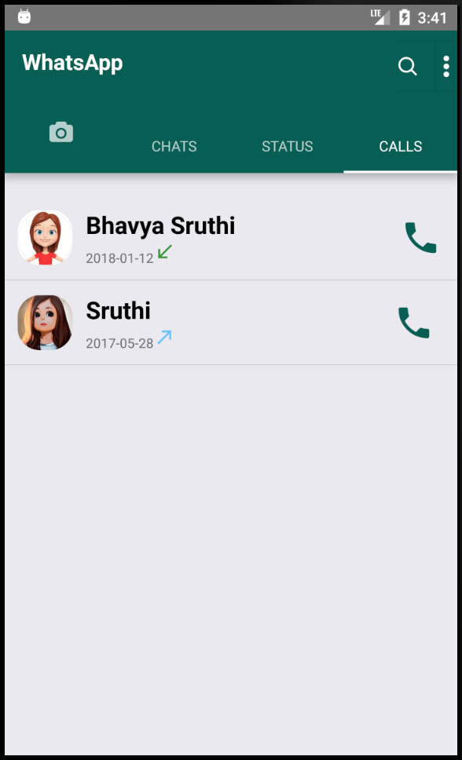

# WhatsApp

WhatsApp clone is created using React Native framework. It connects to the PostgreSQL database using Hasura Data API's. It demonstrates a full-fledged mobile app that works exactly like WhatsApp Android version. In this app, the frontend is developed using React and backend part is developed using Hasura API's which can be easily replaced by Node.js endpoints.  
Screenshots of WhatsApp app - 

## Chats Screen:

This is the default tab of the mobile app that gets displayed by default when we open the WhatsApp. This tab shows the history of chats with our contacts sorted according to the date.

- js/Chats.js : 
1. In this file, we created Chats as view component that needs to be rendered as part of Chats tab.
2. In componentDidMount() lifecycle method of Chats component, we retrieved chats data from the database using fetch(URL, requestOptions) method.
3. If fetch() retrieves data successfully, we parsed the result into ListView component of React Native
4. In render(), we displayed ListView component with each row from ChatRow component. 

- js/ChatsRow.js :
1. This component represents each row in the chats list.
2. Each chat row is fetched from the database by filtering it userId and corresponding msgId.
3. Then we displayed each row with corresponding user profile picture, message first line and also timestamp of the message.

## Calls Screen:

This tab shows the history of calls with user contacts sorted according to the date.

- js/Calls.js : 
1. In this file, we created Calls as view component that needs to be rendered as part of Calls tab.
2. In componentDidMount() lifecycle method of Calls component, we retrieved chats data from the database using fetch(URL, requestOptions) method.
3. If fetch() retrieves data successfully, we parsed the result into ListView component of React Native
4. In render(), we displayed ListView component with each row from ChatRow component. 

- js/CallsRow.js :
1. This component represents each row in the calls list.
2. Each call row is fetched from the database by filtering it userId and corresponding msgId.
3. Then we displayed each row with corresponding user profile picture, call status(incoming/outgoing/missed call) and also timestamp of the call.
